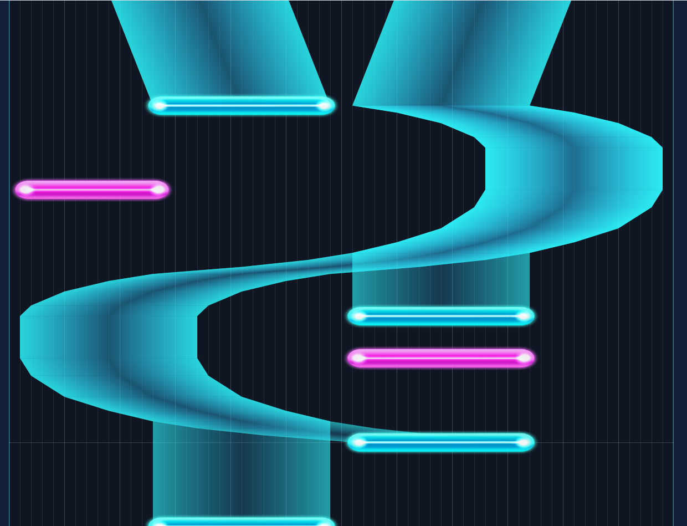

# llll 平面谱面预览

把 Link! Like! LoveLive! 的原格式谱面画成**平面图**：横轴 = 60 格轨道，纵轴 = 时间**向上递增**——
和游戏一样是下落式朝向，上方是更晚的时刻。

非官方研究工具，不是游戏客户端。不做判定、不播音频，只负责把谱面形状画清楚。



## 运行

要求 Node.js 22.12+ 与 pnpm。

```bash
pnpm install
pnpm dev
```

打开终端显示的地址，点「导入谱面」或把文件拖进画布。支持原格式 JSON 与 raw-deflate `.bytes`；文件不上传。

```bash
pnpm test          # 解析与几何单测
pnpm test:browser  # 浏览器交互（需 pnpm exec playwright install chromium）
pnpm build
pnpm verify:corpus "<本地谱面目录>"   # 对语料跑解析与几何校验
```

## 已实现

- 四类音符：Single / Hold / Flick / Trace，使用原版贴图 `ui_sc2_ingame_notes_*`，横向九宫格拉伸。
- Hold 走原版三列顶点色宽带：左/右列 SideColor(45,248,255)、中列 CenterColor(46,198,255)，未按住时 alpha 分别 0.60 / 0.20；头尾另贴端头贴图。
- Hold 链按源数组顺序逐节点绘制，同 tick 折返的航点不被重排。
- 同时押连线（判定时刻差 < 4 ms 分组）。
- 小节线：按 BPM 段与拍号段推进，段首为强拍。
- 横向缩放、轨道宽度、音符厚度、轨道格线、小节线、同时押、左右镜像。
- 时间轴向上（下落式朝向）；拖动平移、滚轮缩放、定位到指定秒（该时刻落在视口底边）。
- 悬停读出音符的编号、类型、轨道、时刻与航点数。
- 导入失败保留已有谱面并报错。

## 为什么另起一个仓库

`llll-preview-web` 的渲染链围绕原版相机与场景层级搭建（世界坐标 → 透视相机 → 分层场景 → HUD）。平面视图只需要二维坐标，套进那条管线等于把 3D 管线当底座再架空一层。

这里退化成「一次画一堆矩形」，依赖只有 Vite 与 TypeScript。两个仓库各自持有一份解析实现，口径漂移由 `scripts/cross-check.ts` 兜底。

## 依据与限制

参见 [设计说明](docs/design.md) 与 [实现依据](docs/evidence.md)。

- 源格式与链语义以 `llll-preview-web` 的既有实现为口径；该仓库已用谱面语料与二进制 dump 交叉核验。
- 横向不做 3D 侧的 `worldWidthOf` 缩放：那条公式服务世界空间的观感，平面视图直接用格宽。
- 不宣称与原版任何视图一致。原版没有这个视角，本工具是另一种读谱方式。
- 默认不含游戏谱面与音频；只能导入已解密谱面，不提供解密入口。
- 16 MiB 谱面、50,000 音符为加载上限。
