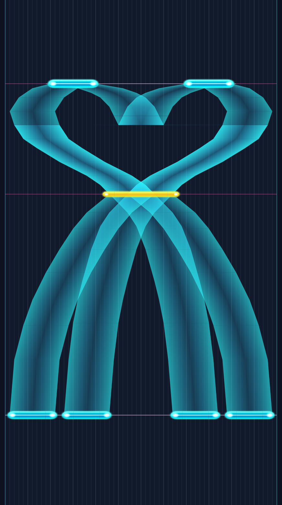

# llll-chart-svg

把莲之空（Link! Like! ラブライブ！）的原格式谱面渲染成 **SVG 矢量图**。

- 横轴 = 60 格轨道，纵轴 = **时间向上递增**（和游戏一样是下落式朝向）
- 音符 / Hold / Flick 的外观与几何口径对齐原版客户端，贴图取自原包
- 输出是纯文本矢量图：可无损缩放、可用浏览器打开、可用 CSS 改配色、能塞进版本库做 diff

## 参考

本仓库的 SVG 结构参考 [pjsekai-scores-rs](https://github.com/Team-Haruki/pjsekai-scores-rs)
（Project SEKAI 谱面渲染器，核对版本 `986de2e`）：

- `defs` 内嵌一份 CSS 类 + 每张贴图只内嵌一次、正文用 `<use>` 引用
- 分层的元素组织（背景 / 轨道 / 小节线 / 拍线 / 带身 / 音符 / 装饰）
- 九宫格与平铺都靠嵌套 `<svg>` + `viewBox` 裁剪源图实现

差别：那边把长曲切成多段嵌套 `<svg>` 横向并排，这边整谱一张纵向长图（`--from/--to` 出局部图）。

口径来源见 [`docs/evidence.md`](docs/evidence.md)。



*上例：`--from 103.0 --to 104.7 --px-per-sec 900 --lane-px 14`，由四条 Hold 织出的图形。*

## 安装

```bash
pnpm install
```

需要 Node 20+（用了原生 `node:zlib` 解 raw-deflate）。贴图与元数据已在 `public/rg/`，开箱即用。

## 用法

```bash
pnpm render <谱面.bytes|.json> -o <输出.svg> [选项]
```

| 选项 | 说明 |
|---|---|
| `--lane-px <n>` | 每格轨道宽度（默认 16） |
| `--px-per-sec <n>` | 每秒纵向像素（默认 220） |
| `--pad <n>` | 上下左右留白（默认 16） |
| `--from <秒>` / `--to <秒>` | 只渲染这一段（长曲出局部图，文件小很多） |
| `--mirror` | 左右镜像 |
| `--no-grid` / `--no-measures` / `--no-beats` / `--no-simul` | 关掉对应层 |
| `--bar-numbers` | 标小节号 |
| `--transparent` | 透明背景 |
| `--link-assets` | 贴图用链接而非内嵌（SVG 更小，但需带上贴图目录） |
| `--css <file>` | 追加样式表 |

例：

```bash
# 整谱
pnpm render chart.bytes -o chart.svg --px-per-sec 240

# 只看 103.0–104.7 秒（抱花的爱心段）
pnpm render chart.bytes -o heart.svg --from 103.0 --to 104.7 --px-per-sec 900 --lane-px 20
```

## 输出

一张自包含的 SVG：

```
<svg width="992" height="30214" viewBox="0 0 992 30214">
  <defs><style>…CSS 类…</style>
        <image id="sp-ui_sc2_ingame_notes_tap" xlink:href="data:image/png;base64,…" …/>
        <linearGradient id="bg0" gradientUnits="userSpaceOnUse" …/></defs>
  <rect class="bg" …/>          ← 背景
  <rect class="lane" …/>        ← 轨道栏
  <line class="lane-line" …/>   ← 格线（每 5 格一条加粗）
  <line class="bar-line" …/>    ← 小节线
  <line class="beat-line" …/>   ← 拍线
  <line class="simul" …/>       ← 同时押连线
  <path fill="url(#bg0)" …/>    ← Hold 宽带（三列顶点色）
  <svg viewBox="0 0 60 68" …>   ← 音符（九宫格三段）
  …
</svg>
```

配色由 `defs` 里的 CSS 类控制，用 `--css` 追加即可覆盖。类名：`.bg` `.lane` `.edge`
`.lane-line` `.lane-line-major` `.bar-line` `.beat-line` `.simul` `.bar-text`。

## 已实现

- 四类音符：Single / Hold / Flick / Trace，原版贴图 + 横向九宫格拉伸（端头不变形）
- Hold 三列顶点色宽带：左右列 `SideColor(45,248,255)` α=0.60、中列 `CenterColor(46,198,255)` α=0.20
- Hold 链按源数组顺序逐节点绘制，同 tick 折返的航点不被重排；串链汇合点去重
- Flick 三层附加元素：平铺箭头（左右各一）、`Symbol`、`Sign`（沿「上」抬 1 世界单位）
- 小节线 / 拍线 / 轨道格线 / 同时押连线（判定时刻差 < 4 ms）
- 时间段渲染、镜像、透明背景、外挂样式表

## 范围

不做：3D 透视、判定、音频同步、节拍器动画。定位是「出静态谱面图」。

## 校验

```bash
pnpm build            # tsc --noEmit
pnpm test             # 单测（解析 / 布局 / 几何 / SVG 结构）
pnpm verify:corpus    # 617 张谱面全量渲染，检查统计自洽与标签配平
pnpm cross-check      # 与 llll-flat-preview 逐音符比对解析口径与几何量
```

`cross-check` 是口径漂移的兜底：两个仓库各自独立持有实现（不共享代码），
对同一批谱面必须给出相同的音符、串链拓扑、贴图尺寸与时间轴映射。

## 许可

MIT。音符贴图来自游戏原包，仅用于本地研究。
