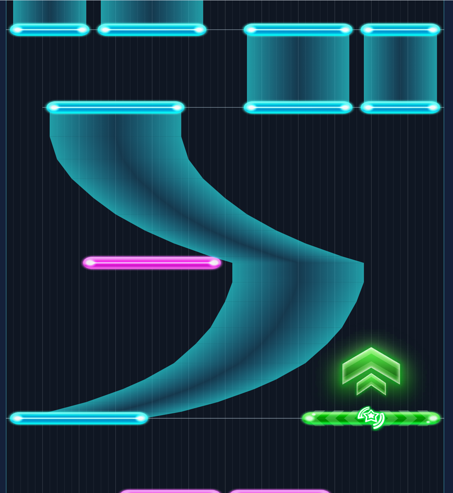

# flat-preview · 2D 几何与契约校验核心

把 Link! Like! LoveLive! 的原格式谱面画成**平面图**：横轴 = 60 格轨道，纵轴 = 时间**向上递增**——
和游戏一样是下落式朝向，上方是更晚的时刻。

非官方研究工具，不是游戏客户端。不做判定、不播音频，只负责把谱面形状画清楚。



## 使用

要求 Node.js 22.12+ 与 pnpm。

```bash
pnpm install
pnpm --filter @sukushow/web dev
```

该包提供 2D 谱面解析、几何和 Canvas 渲染的独立校验核心。LLLL 工作台的 2D / 3D 切换使用 `packages/llll-preview` 的同一 WebGL 场景，只改变相机角度；支持原格式 JSON 与 raw-deflate `.bytes` 的解析校验。

```bash
pnpm test          # 解析与几何单测
pnpm build
pnpm verify:corpus   # 对 workspace 谱面跑解析与几何校验
```

## 已实现

- 四类音符：Single / Hold / Flick / Trace，使用原版贴图 `ui_sc2_ingame_notes_*`，横向九宫格拉伸。
- Flick 的三层附加元素：平铺箭头（左右各一）、`Symbol`、`Sign`，尺寸取自 prefab 授权值。
- Hold 走原版三列顶点色宽带：左/右列 SideColor(45,248,255)、中列 CenterColor(46,198,255)，未按住时 alpha 分别 0.60 / 0.20；头尾另贴端头贴图。
- Hold 链按源数组顺序逐节点绘制，同 tick 折返的航点不被重排。
- 同时押连线（判定时刻差 < 4 ms 分组）。
- 小节线：按 BPM 段与拍号段推进，段首为强拍。
- 横向缩放、轨道宽度、音符厚度、轨道格线、小节线、同时押、左右镜像。
- 时间轴向上（下落式朝向）；拖动平移、滚轮缩放、定位到指定秒（该时刻落在视口底边）。
- 悬停读出音符的编号、类型、轨道、时刻与航点数。
- 导入失败保留已有谱面并报错。

## 实现边界

`packages/flat-preview` 提供二维解析、几何与 Canvas 渲染校验核心；`packages/llll-preview` 提供 LLLL 解析、WebGL 渲染与导出，`apps/web` 负责统一工作台和相机角度切换。

平面视图以矩形、九宫格贴图和时间轴表达谱面形状，契约校验由 `scripts/cross-check.ts` 维护。

## 依据与限制

参见 [设计说明](docs/design.md) 与 [实现依据](docs/evidence.md)。

- 源格式与链语义以 `packages/llll-preview` 的实现为口径，并用谱面语料与二进制 dump 交叉核验。
- 横向不做 3D 侧的 `worldWidthOf` 缩放：那条公式服务世界空间的观感，平面视图直接用格宽。
- 不宣称与原版任何视图一致。原版没有这个视角，本工具是另一种读谱方式。
- 默认不含游戏谱面与音频；只能导入已解密谱面，不提供解密入口。
- 16 MiB 谱面、50,000 音符为加载上限。
